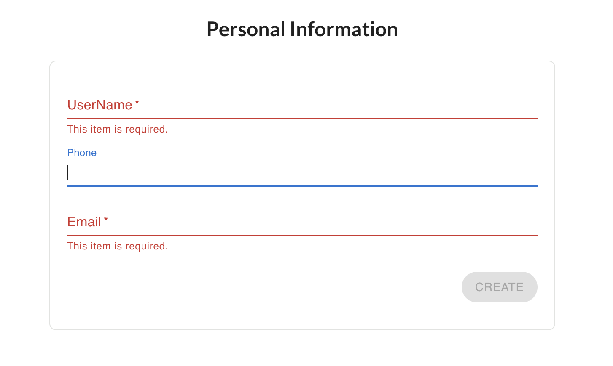
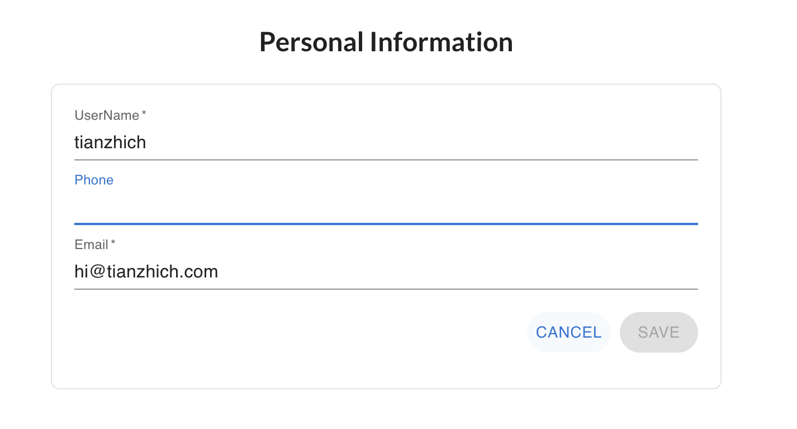
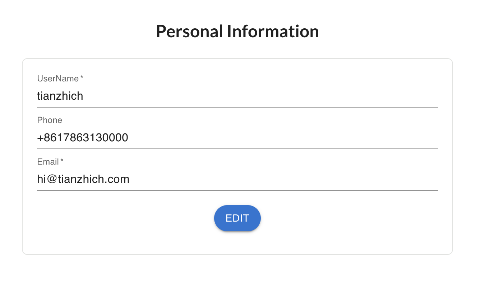
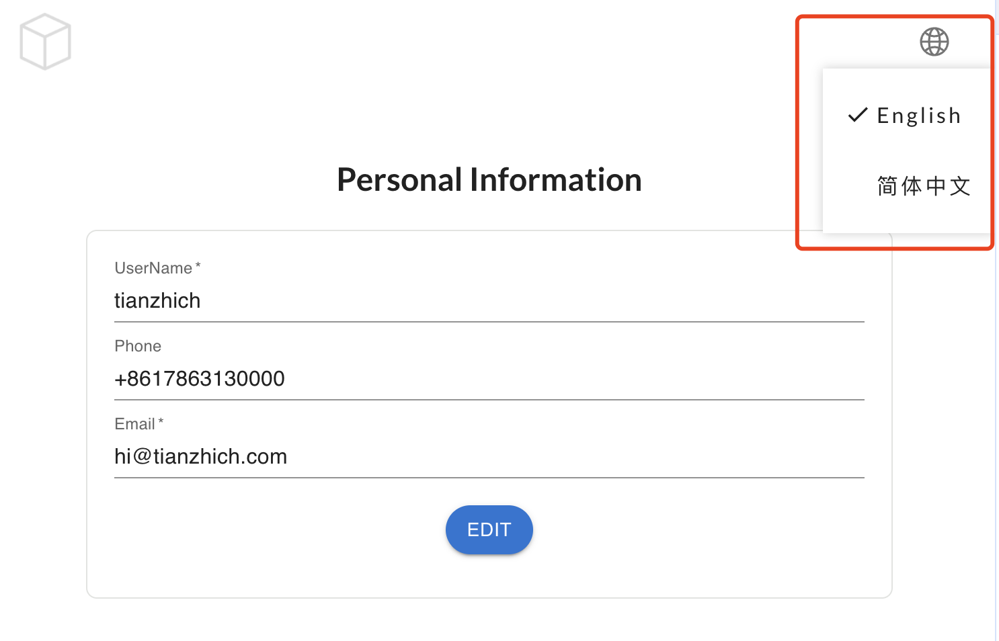
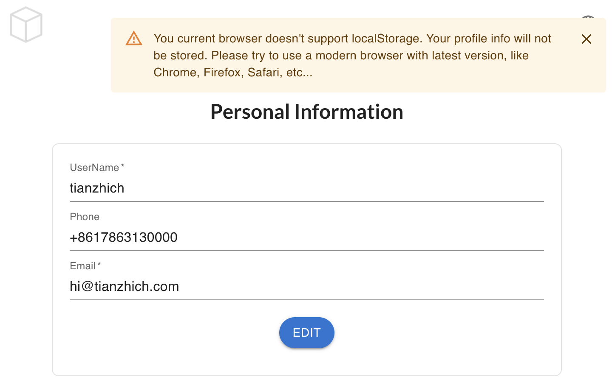
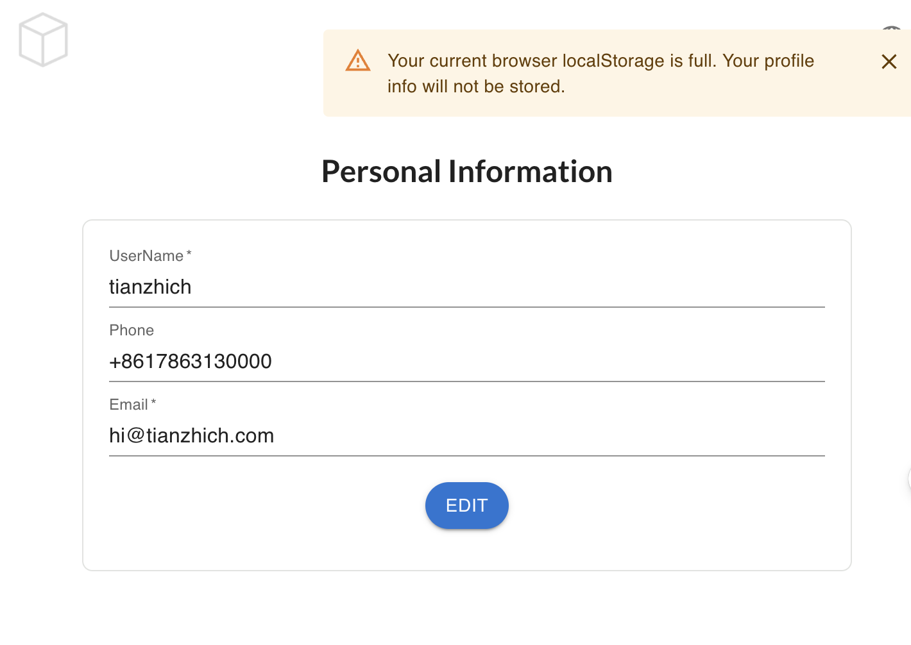

# Blocklet Profile Demo

This project was bootstrapped with [Create Blocklet](https://github.com/blocklet/create-blocklet). It shows the demo profile of a local user.

## How to Use

### Create or edit your profile

You can create your own profile. Input your username, phone and email. The username and email is required. Here are the rules of each field:

- UserName: It starts with a letter, be 5 to 15 characters long, and only contain letters, numbers, and underscores.
- Phone: It starts with a optional plus sign, followed by a non-zero digit, and then 1 to 14 additional digits, commonly used for international phone numbers.
- Email: It takes the commonly used email address.

If you are in editing mode, you can cancel your editing whenever you want.

### View your profile

After you create or edit your profile. You can view the information. All of your informations are stored securely in your own browser. No one can get it without your permission.

### Change your prefered language

You can use your prefered language by clicking the globe icon button on the top-right of the page. Now you can use:

- 简体中文
- English

We are working on ways support more languages as soon as possible. Stay tuned!

### What if the local storage of your browser is unavailable?

Please make sure to use the modern browsers like Chrome, FireFox, Safari or Microsoft Edge to access this demo. If your browser don't support the [localStorage API](https://developer.mozilla.org/en-US/docs/Web/API/Window/localStorage#browser_compatibility), your profile will not be stored. But you can still use it as you'd like.

There is one rare scenario that your localStorage quota is exceeded. If this happens, your profile will also not be stored.

Feel free to contact me if you have any other questions.

## More about blocklet

If you want to know more about blocklet, like its file structures, ci process, etc..., feel free to check this [document](./blocklet.md).

## License

The code is licensed under the Apache 2.0 license found in the
[LICENSE](LICENSE) file.
